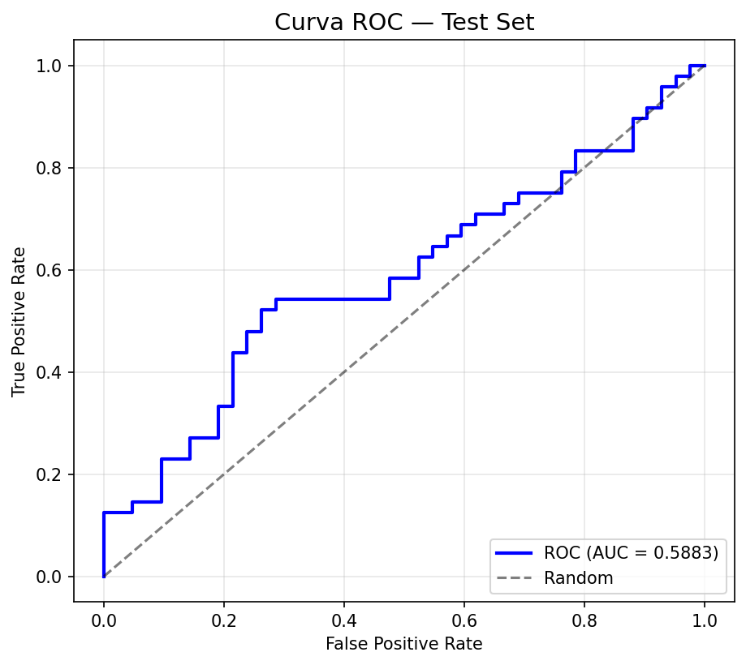
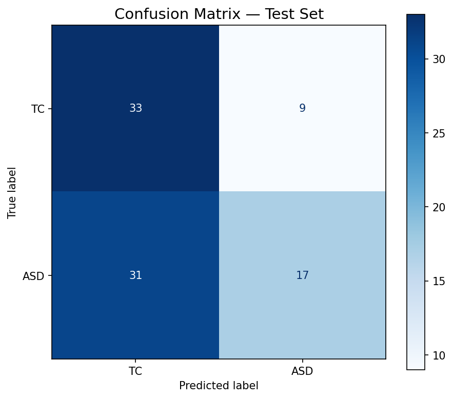

# Clasificación de autismo (ASD) desde rs-fMRI como problema de Visión por Computadora — CNN + generalización de dominio adversarial (DANN)

[](https://www.python.org/)
[](https://pytorch.org/)
[](LICENSE)
[](https://github.com/astral-sh/uv)
[](https://github.com/SMESCH1/TP_CV/actions/workflows/ci.yml)

> 🇬🇧 **English version:** [README.md](README.md)

Clasificación binaria de **Trastorno del Espectro Autista (ASD)** vs. **controles típicos (TC)** a partir de resonancia magnética funcional en reposo, replanteada como tarea de **visión por computadora**: en lugar de matrices de conectividad, convertimos mapas derivados voxel-wise (**fALFF** y **ReHo**) del consorcio [ABIDE](http://fcon_1000.projects.nitrc.org/indi/abide/) en **cortes 2D en escala de grises** y entrenamos una **CNN** pequeña. Para mitigar el sesgo instrumental multicentro (*site effects*) agregamos una **red adversarial de dominio (DANN)**, de modo que el extractor de features aprenda representaciones invariantes al sitio y generalice a **scanners no vistos**.

> ⚕️ **Proyecto académico — no es una herramienta de diagnóstico.** Realizado para la materia de Visión por Computadora (Maestría en IA). El objetivo es un pipeline reproducible de punta a punta y una evaluación honesta de la adaptación adversarial de dominio, *no* el uso clínico.

---

## Resultados clave

Dos modelos idénticos (mismos hiperparámetros, mismos datos) que difieren **únicamente** en el término adversarial de dominio. El test son dos **sitios completos reservados** (`PITT` + `OLIN`, 90 sujetos) nunca vistos en entrenamiento — una prueba real de generalización fuera de distribución.

| Métrica (sitios held-out) | Sin DANN | **Con DANN** |
|---|:---:|:---:|
| ROC AUC | 0.552 | **0.588** |
| Balanced accuracy | 0.504 *(≈ azar)* | **0.570** |
| Accuracy | 0.478 | **0.556** |
| F1 (ASD) | 0.175 | **0.459** |
| AUC @ OLIN | 0.568 | **0.618** |
| AUC @ PITT | 0.527 | **0.557** |

**Conclusión:** sin DANN el modelo colapsa hacia el azar en scanners no vistos (balanced accuracy ≈ 0.50), mientras que con DANN mantiene una **ventaja pequeña pero consistente** en ambos sitios. Los valores absolutos son modestos *a propósito* — ver [Resultados honestos y limitaciones](#resultados-honestos-y-limitaciones).

<p align="center">
  
  
</p>

---

## Enfoque

1. **Replanteo CV.** Consumimos mapas paramétricos 3D (fALFF, ReHo) ya registrados al espacio **MNI152**, no BOLD 4D crudo ni conectomas.
2. **Cortes seleccionados estadísticamente.** Para cada derivado y eje elegimos el corte ortogonal que maximiza el Cohen's *d* voxel-wise entre grupos — calculado **solo sobre sujetos de entrenamiento** para evitar leakage. Cada sujeto se vuelve un tensor de **6 canales** (2 derivados × 3 vistas).
3. **CNN pequeña** que explota patrones espaciales locales.
4. **DANN** con capa de inversión de gradiente (GRL): un clasificador de dominio sobre los 18 sitios de entrenamiento empuja al extractor hacia features invariantes al sitio (*domain generalization* adversarial multi-fuente).
5. **Splits sin leakage:** por sujeto *y* por sitio (sitios completos reservados para test).

Metodología completa: [docs/contexto_proyecto.md](docs/contexto_proyecto.md) · criterio de cortes: [docs/cortes_mni_y_mapas_derivados.md](docs/cortes_mni_y_mapas_derivados.md) · informe final: [docs/INFORME_FINAL.md](docs/INFORME_FINAL.md) · referencias: [docs/referencias.md](docs/referencias.md).

---

## Inicio rápido

Con [uv](https://github.com/astral-sh/uv):

```bash
uv sync
```

**1 — Generar el dataset (descarga derivados ABIDE → PNGs 2D):**

```bash
uv run python main.py                              # tabla fenotípica completa
uv run python main.py --max-subjects 20 --subset-seed 42   # prueba rápida
```

**2 — Entrenar (CNN + DANN). Los hiperparámetros viven en un único [config.toml](config.toml):**

```bash
uv run python scripts/train.py --config config.toml --mode dann      # con DANN
uv run python scripts/train.py --config config.toml --mode no-dann   # baseline (alpha=0)
```

**3 — Reproducir la comparación cabeza a cabeza:**

```bash
uv run python scripts/compare_dann.py --config config.toml
```

**Opcional — búsqueda de hiperparámetros (Optuna + MLflow):**

```bash
uv run python scripts/tune.py    # el study persiste en SQLite (reanudable); trials en ./mlruns
```

Cada corrida escribe métricas y gráficos (curvas, matriz de confusión, ROC, reporte) en `results_dann/` o `results_no_dann/`.

---

## Estructura del repositorio

```
main.py                 # generación del dataset (NIfTI ABIDE → cortes PNG 2D)
config.toml             # hiperparámetros compartidos por ambos modelos
scripts/
  downloader.py         # descarga derivados ABIDE, extrae cortes
  dataset.py            # dataset agrupado por sujeto y splits
  model.py              # CNN + DANN (capa de inversión de gradiente)
  train.py              # entrenamiento + evaluación + gráficos
  compare_dann.py       # DANN vs sin-DANN cabeza a cabeza
  tune.py               # búsqueda de hiperparámetros con Optuna
  evaluate.py           # evaluación standalone
  validate_labels.py    # chequeo de integridad de etiquetas (carpeta vs CSV vs modelo)
statistical_analysis/   # selección de cortes óptimos tipo VBM (Cohen's d)
results_dann/ , results_no_dann/   # métricas + gráficos por modelo
docs/                   # contexto técnico, referencias, informe final
paper/                  # informe en LaTeX (IEEEtran)
```

---

## Reproducibilidad

- **Fuente única de hiperparámetros:** [config.toml](config.toml) lo comparten ambos modelos; lo único que cambia es el término DANN (`dann_alpha`, forzado a `0` en el baseline).
- **Semilla fija:** `seed = 42` controla splits e inicialización, así las corridas son repetibles.
- **Regenerar gráficos y métricas:** `uv run python scripts/compare_dann.py --config config.toml` reentrena ambos modelos y reescribe los artefactos en `results_dann/` y `results_no_dann/`.
- **Regenerar la tabla de resultados de arriba:** `uv run python scripts/report.py` lee los `metrics_summary.json` e imprime la tabla en Markdown — los números de este README no están escritos a mano.

## Resultados honestos y limitaciones

Este problema es **genuinamente difícil** y el README lo refleja a propósito:

- Los cortes ganadores tienen **|Cohen's d| ≈ 0.07–0.09** — convencionalmente "despreciable". El método de selección es correcto; la señal subyacente es débil, consistente con la dificultad conocida de discriminar ASD vs TC a nivel de sujeto en rs-fMRI.
- Comprimir volúmenes 3D float a cortes PNG de 8 bits **pierde rango dinámico** (un trade-off deliberado para un prototipo de CNN 2D; el NIfTI cacheado sigue siendo la fuente de verdad).
- Reportar un modelo cercano al azar sin DANN, y solo modestamente por encima con DANN, *es* el punto: el aporte es **medir si la generalización de dominio adversarial ayuda en sitios no vistos**, no perseguir un accuracy de titular.

---

## Equipo y atribución

Trabajo grupal para **Visión y Percepción Computarizada**, Maestría en Inteligencia Artificial.

- Sebastián Mesch Henriques · [@SMESCH1](https://github.com/SMESCH1)
- Leandro Carcagno · [@lcgno](https://github.com/lcgno)

Este repositorio es un fork de portfolio del repositorio original del equipo. El código está bajo licencia MIT; el **dataset ABIDE y sus derivados CPAC se rigen por sus propios términos de uso** — ver la documentación de [ABIDE](http://fcon_1000.projects.nitrc.org/indi/abide/) y del Preprocessed Connectomes Project.
